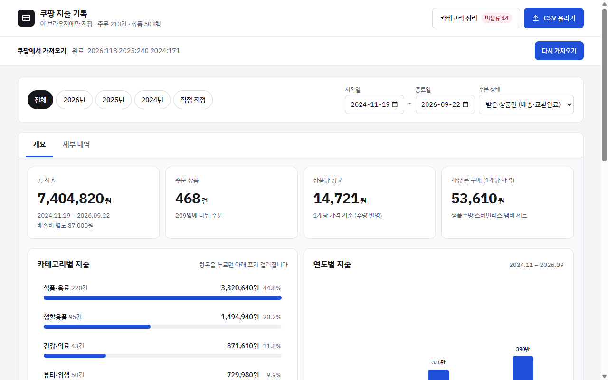

# coushboard-extension

쿠팡 주문내역을 연도 구분 없이 가져와 기간별, 카테고리별, 품목별 지출로 보여 주는 Chrome 확장.
#### 카테고리를 직접 수정 가능하고, 동일한 종류의 다른 제품을 구매했을 때 함께 집계 가능 ( ex, 코카콜라/펩시 -> 콜라 )

## Quick Start
| 1 | 2 | 3 | 5 |
|---|---|---|---|
|||| 
|

1. 현재 화면 우측의 Releases에서 최신 `coushboard-extension-v*.zip`을 내려받아 압축을 풂.
2. `chrome://extensions`를 열고 우측 상단의 **개발자 모드**를 켬.
3. 좌측 상단의 **압축해제된 확장 프로그램을 로드합니다**를 눌러 압축 푼 폴더를 선택함.
4. 쿠팡에 로그인함.
5. 확장 아이콘의 팝업에서 **가져오기 시작**을 누름. 5분 가량 소요.
6. 팝업의 **대시보드 열기**로 결과를 확인함.
7. 다음부터는 팝업의 **새 주문 가져오기**를 누름. 새 주문만 가져와 이전 내역에 합치고 멈춰서 몇 초면 끝남.

## Screenshots

세부 내역 / 수집 팝업(진행 중). 아래 화면은 예시(mock) 데이터

| 세부 내역 |
|---|
| 
## Overview

- 데이터는 **이 브라우저에만 저장**함. 서버로 보내는 것이 없음.
- 대시보드는 개요, 세부 내역, 카테고리 정리, CSV 올리기를 제공함.
- 수집은 쿠팡 탭에서 돌고 진행 상태가 저장되어, **팝업을 닫아도 계속**되고 중단되면 이어서 수집할 수 있음.
- 두 번째 수집부터는 **새 주문만 가져오고** 이미 가진 주문을 만나면 멈춤. 새 주문은 이전 내역과 합쳐져 함께 보임. 전체를 다시 받으려면 **전체 다시 가져오기**를 누름.
