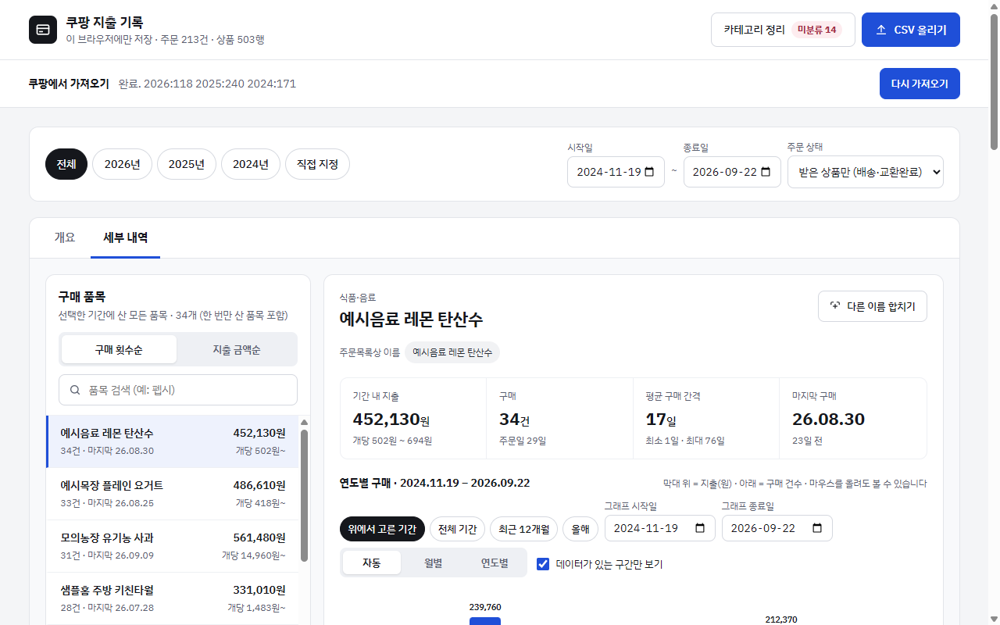
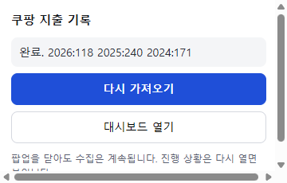

# coushboard-extension

쿠팡 주문내역을 연도 구분 없이 가져와 기간별, 카테고리별, 품목별 지출로 보여 주는 Chrome 확장.


## Overview

- 로그인한 브라우저에서 쿠팡 주문목록을 **직접 가져옴**. 쿠팡 내부 주문 API에 읽기 전용 요청을 2초 이상 간격으로 보냄.
- 데이터는 **이 브라우저에만 저장**함. 서버로 보내는 것이 없음.
- 대시보드는 개요, 세부 내역, 카테고리 정리, CSV 올리기를 제공함.
- 수집은 쿠팡 탭에서 돌고 진행 상태가 저장되어, **팝업을 닫아도 계속**되고 중단되면 이어서 수집할 수 있음.
- 쿠팡의 비공개 내부 API를 쓰므로 쿠팡이 구조를 바꾸면 동작하지 않을 수 있음.
- CSV 업로드 기반 웹앱(coushboard)과는 별도 프로젝트임.

## Screenshots

세부 내역 / 수집 팝업. 아래 화면은 예시(mock) 데이터이며 `docs/images/`의 파일을 바꾸면 교체됨.

| 세부 내역 | 수집 팝업 |
|---|---|
|  |  |

## Quick Start

1. Releases에서 `coupang-ledger-ext-v0.2.0.zip`을 내려받아 압축을 풂.
2. `chrome://extensions`를 열고 **개발자 모드**를 켬.
3. **압축해제된 확장 프로그램을 로드합니다**를 눌러 압축 푼 폴더를 선택함.
4. 쿠팡에 로그인함.
5. 확장 아이콘의 팝업에서 **가져오기 시작**을 누름. 주문 760줄 기준 약 5분 걸림.
6. 팝업의 **대시보드 열기**로 결과를 확인함.

## How to Run

Node 24 이상(`.nvmrc`)이 필요함. 오라클 테스트에는 Python이 필요함.

```
npm install
npm run build
```

- 빌드하면 `extension/app/`이 만들어지고, `extension/` 폴더를 위 3번처럼 로드하면 됨.
- `npm run pack`은 배포용 zip을 `release/`에 만듦.
- `npm run verify`는 타입 검사, 린트, 단위 테스트, 확장 코드 테스트, 개인정보 검사를 실행함.
- `npm run test:e2e`는 확장을 Chromium에 로드해 화면과 수집 시나리오를 실행함. 쿠팡에는 접속하지 않고 합성 응답을 씀.
